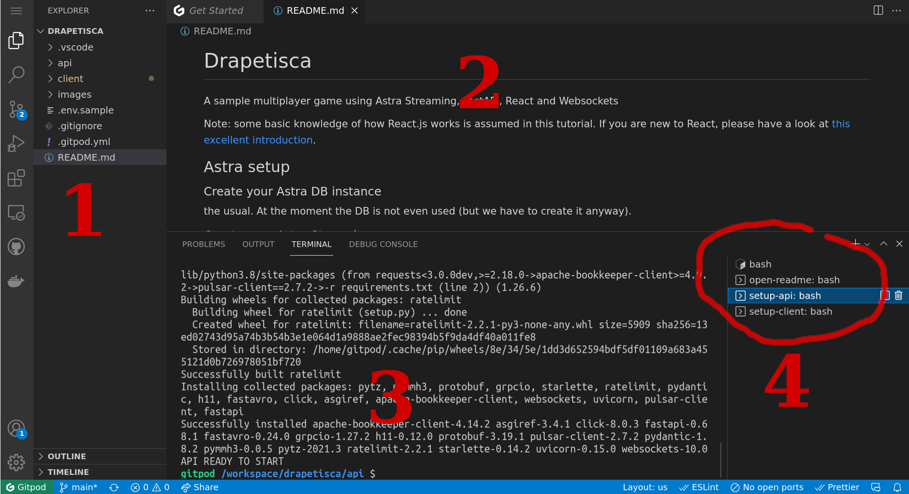
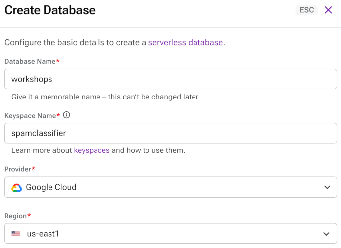
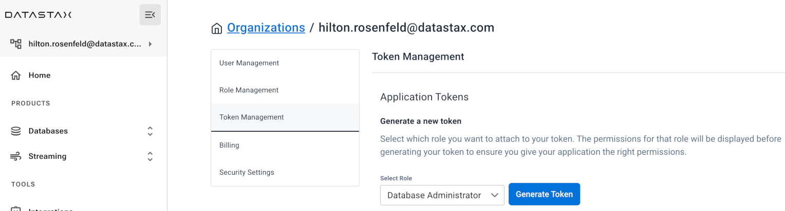
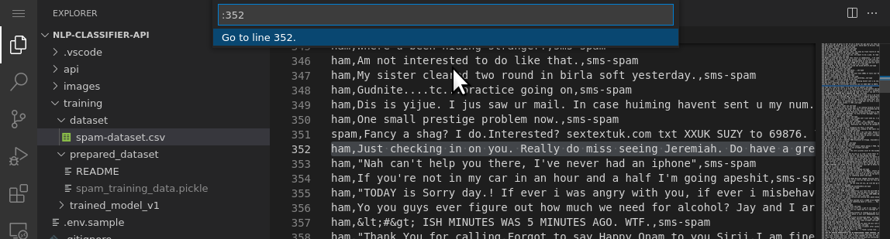
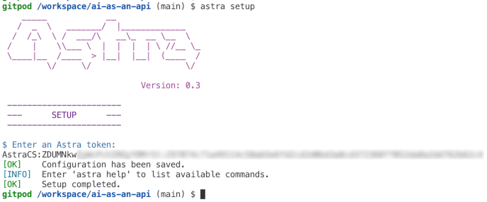
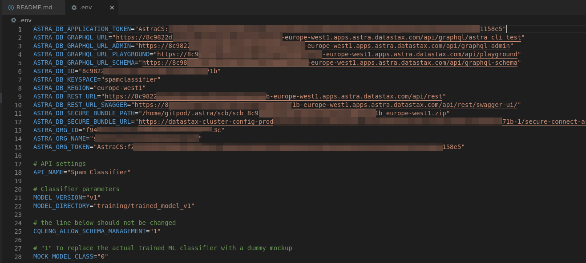
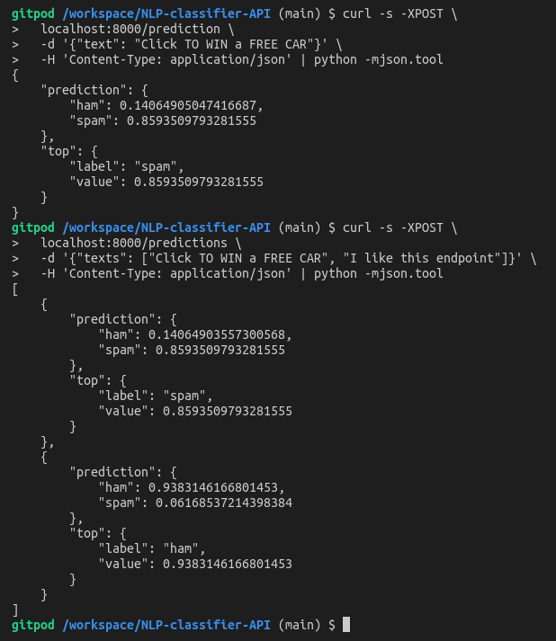
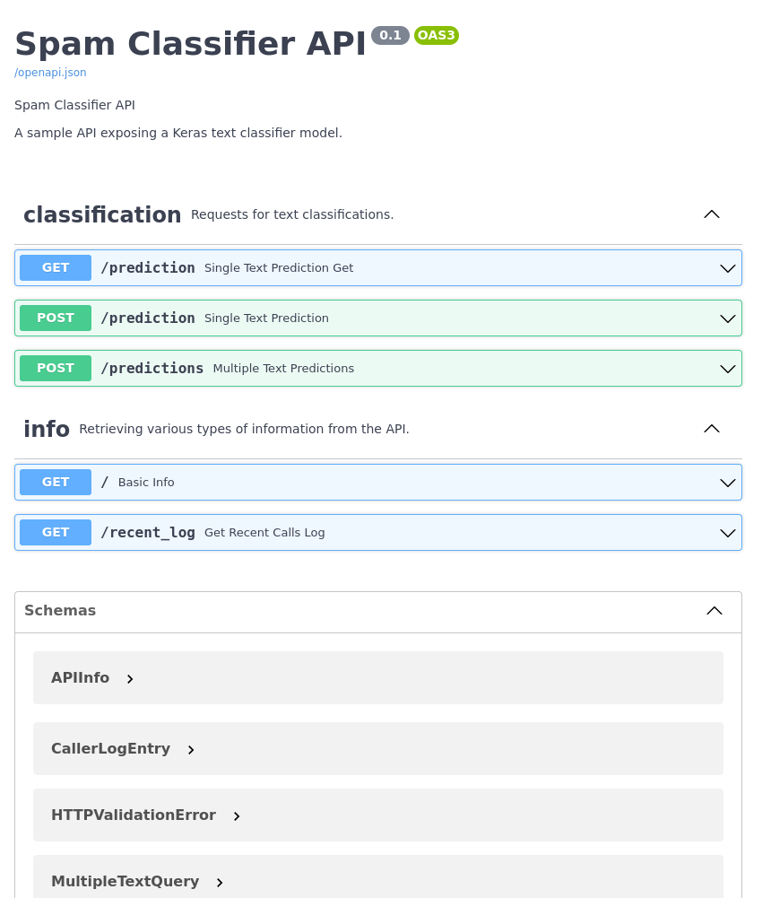

# Workshop: IRT AI / ML

<br />

### Learn to build your own NLP text classifier and expose it as an API using the following technologies:

- AI-based text analysis with Tensorflow/Keras;
- Astra DB, a Database-as-a-Service built on Apache Cassandra®;
- FastAPI, the high-performance Python framework for creating APIs;
- Many useful Python libraries and packages including `pandas`, `pydantic`, `dotenv`, `sklearn`, `uvicorn`, and more.

### During this hands-on workshop, you will:

- prepare the labeled dataset for model training;
- train the model to classify any input text;
- export the trained model and test it interactively;
- create your free NoSQL database for data storage;
- set up and start an API exposing the classifier as a reusable class;
- learn how to speed up the API with DB-based caching;
- inspect how a streaming response is handled in the API.

### Prerequisites:

- Familiarity with Python.
- A GitHub account.
    > If you do not have a GitHub account, create a free account at [GitHub](https://github.com/signup).

### Procedure:
To start with you will initialise a GitPod environment. The remainder of the workshop continues from within the GitPod environment.

---

<br />

# Step 1: Gitpod

Gitpod is an IDE in the cloud (modeled after VSCode). It comes with a full "virtual machine" (actually a Kubernetes-managed container), which you will use as if it were your own computer (e.g. downloading files, executing programs and scripts, training the model and eventually starting the API from it).

The button below will:

- spawn your own Gitpod container;
- clone this repository in it and open it in the IDE;
- preinstall the required dependencies.


**Click on the Gitpod button:**

<a href="https://gitpod.io/#https://github.com/HiltonRosenfeld/ai-as-an-api"></a>

> **Note**: you may have to authorise GitPod to sign in with your GitHub account.

> **Note**: For Choose an Editor, select VS Code • 1.x.x • Browser.

In a few minutes, a full IDE will be ready in the browser, with a file explorer on the left, a file editor on the top (with this very README open for convenience), and a console (`bash`) below it. Actually three consoles will be spawned for later convenience:

- `work-shell` (where the main work is done including running the API)
- `curl-shell` (to later issue `curl` commands to the API)
- `notebook-shell` (where Jupyter will keep running)

> **Note**: If you want to work on your laptop, make sure you install all Python dependencies listed in `requirements.txt` (doing so in a Python virtual environment is strongly suggested) and add the main repo root to the `PYTHONPATH`. (You might see "errors" related to mismatching versions between the `tensorflow` package and others, notably `numpy`: you should be able to ignore them and just go ahead.) If you are on Python 3.6, you will additionally need to install the `dataclasses` package (i.e. `pip install dataclasses`). Also, please note that the model training phase may take much longer than ten minutes, depending on your processing power.

<details>
<summary>
Show me a map of the Gitpod starting layout
</summary>



1. File explorer
2. Editor
3. Panel for console(s)
4. Console switcher
There are many more other features, probably familiar to those who have experience with VSCode. Feel free to play around a bit!
</details>

> **Note**: make sure you locate the "console switcher" on the bottom right; all commands, unless specified otherwise, are to be launched in the "work-shell" console.


<br />

# Step 2: Create a database in Astra DB

You will now create a database with a keyspace in it (a *keyspace* can contain tables). The API needs a couple of tables for persistent storage: they will be created programmatically on startup if they don't exist, so there's no need to worry too much about them.

Besides creating the database, you need to retrieve a *token*, that is, a set of credentials used later to connect to it in a secure and authenticated way.

1. Login to your Astra account.
    > If you do not have an Astra account, create a free trial account at [Astra Registration](https://astra.datastax.com/register).

2. Create a Database:
    1. Navigate to *Databases* in the Menu.
    2. Click the *Create Database* button.
    3. Create the database using the following:
        * Database Name: `workshops`
        * Keyspace Name: `spamclassifier`
        * Provider: `Google Cloud`
        * Region: `us-east1`
        
        

3. Generate and retrieve a DB Token:
    1. Navigate to *Settings* in the Menu.
    2. Navigate to *Token Management* within the Settings sub-menu.
    3. Select the role `Database Administrator`.
    4. Click the *Generate Token* button.
    5. Click on *Download Token Details*.
    6. Open the downloaded file `GeneratedToken.csv` and verify that you can read the file.

        


<br />

# Step 3. Inspect the Dataset
Open the file `training/dataset/spam-dataset.csv` and have a look at the lines there.
> Tip: you can open a file in Gitpod by locating it with the "File Explorer" on your left, but if you like using the keyboard you may simply issue the command `gp open training/dataset/spam-dataset.csv` from the `bash` Console at the bottom.

This is a CSV file with three columns (separated by commas):

- whether the line is spam or "ham" (i.e. the opposite of spam),
- a short piece of text (a "message"),
- the tag identifying the source of this datapoint (this will be ignored by the scripts).


The third column betrays the mixed origin of the data. To create our labeled dataset of 7,500 messages, two sets made available by the UCI Machine Learning Repository have been merged:
- [SMS Spam Collection Data Set](https://archive.ics.uci.edu/ml/datasets/SMS+Spam+Collection)
- [YouTube Spam Collection Data Set](https://archive.ics.uci.edu/ml/datasets/YouTube+Spam+Collection)

Luckily, the (not always fun) task of cleaning, validating and normalizing the heterogeneous (and usually imperfect) data has been already done for you -- something that is seldom the case, alas, in a real-world task.

Look at line 352 of this file for example. Is that message spam or ham?
> Tip: hit Ctrl-G in the Gitpod editor to jump to a specific line number.

<details>
<summary>Show me that line in Gitpod's editor</summary>


</details>


<br />

# Step 4. Train the Model in Jupyter

In the Gitpod environment, we started Jupyter for you (it is running in the notebook-shell console). To open it, run the following command, which will open a browser to the notebook server listening:

**Use the `work-shell` console**

```
gp preview --external $(gp url 8888)/notebooks/notebook/machineLearning.ipynb
```

> **Note**: The password to unlock the notebook is `spamclassifier`.

<br />

### How to run the Jupyter Notebook
A notebook is made of "cells". Select a cell by clicking on it and execute it with Shift+Enter. Run all code cells in the notebook from the first to the last. 

> **Note**: there are cells with the sole purpose of inspecting the contents of some variables. Take your time, use them to better understand what's going on.

When you have completed the Jupyter Notebook, come back to this document and continue with Step 5.

<br />

# Step 5. Expose the Model as an API

Now your model is trained and saved to disk, ready to be used, it is time to expose it with FastAPI in the form of easy-to-use HTTP requests.

You'll first look at a minimal version of the API, just to get a taste of how FastAPI works, and then turn to a full-fledged version, with more endpoints and a database-backed caching layer.


<br />

## Configure Astra connection .env file
Now you need to prepare a configuration file to give the API all required parameters to connect to the database. Fortunately, the Astra CLI has you covered and will automate most of it for you: all you need is to run a couple of commands.

**Use the `work-shell` console.**


First, configure the Astra CLI so that it knows the "token" part of your DB Admin Token (i.e. the string starting with `AstraCS:...`):

```
astra setup
```

> **Note**: If you get a "command not found" error, please install Astra CLI manually with `curl -Ls "https://dtsx.io/get-astra-cli" | bash` and retry the above commands after running `source ~/.bashrc`.

<details>
<summary>Show me the setup step</summary>

</details>

You can test that everything works by inspecting your database:

```
astra db get workshops
```

<details>
<summary>Show me a typical output</summary>

</details>

At this point you can have the CLI prepare a `.env` file with all required connection information (keyspace name, access token, location of the [secure connect bundle](https://awesome-astra.github.io/docs/pages/astra/download-scb/) which it downloads automatically) available as environment variables:

```
astra db create-dotenv -k spamclassifier workshops
```

Let us add to this file a couple of settings specific to our API:

```
cat .app-env.sample >> .env
```

At this point, the `.env` file should be OK. If you are curious, have a look at what's in it: there will be keyspace name, connection secrets, API settings and so on.

<details>
<summary>Show me what the dot-env file might look like</summary>

</details>

> **Note**: If you don't have (or don't want to use) the actual trained model at hand, you can switch to a lightweight mock by setting `MOCK_MODEL_CLASS="1"` in this dot-env file. The API part of the practice would "not even notice the change".


<br />

## A Minimal API
Now that the trained model is there, the `.env` file is ready and the secure bundle is in place, you can start a minimal form of the API with:

**Use the `work-shell` console.**

```
uvicorn api.minimain:miniapp --reload
```

> **Note**: In this command, you are telling `uvicorn` (an [ASGI server](https://www.uvicorn.org/) capable of running asynchronous Python APIs) to launch the miniapp API found in the minimain module; you also ask it to keep a watch on all involved files and auto-reload on any file change.

After some (rather verbose) output from Tensorflow, you should see the `INFO: Application startup complete`. The API has loaded the classifier and is ready to accept requests (on localhost and port 8000, as per defaults). You will first fire some requests and then have a quick look at how the code is structured.

> **Note**: This code is purposefully kept very simple: besides not implementing all the features, it also refrains from using some of the facilities provided by FastAPI to better focus on the basics. Look at the full API below for a more comprehensive usage of the framework.


<br />

### Query the minimal API
You'll use the command-line tool `curl` to issue simple HTTP requests at your running API (but, of course, any tool capable of doing GETs and POSTs would do).

 **Use the `curl-shell` console**:

```
curl -s http://localhost:8000 | python -mjson.tool
```

This issues a GET request to the `"/"` API endpoint. The result is a small summary, in JSON form, of some of the API parameters inherited through the `.env` file.

The logic to retrieve these settings and make them available to the API is in the config.py module and relies on the pydantic package, that excels at data validation while allowing for surprisingly short and clean code. pydantic pairs very well with FastAPI ([documentation](https://fastapi.tiangolo.com/advanced/settings/)).

> **Note**: If you are feeling adventurous, try stopping the API (Ctrl-C in` the API shell) and re-starting as API_NAME="Fire Dragon!" uvicorn api.minimain:miniapp --reload`. Try again the above `curl` command to see the redefined environment variable `API_NAME` taking precedence over the dot-env file.

This minimal API already accomplishes the basic task for today: namely, it makes the spam classifier available as an API. 

Let's try with some POST requests (**curl-shell console**):

**Run a single-text endpoint**
```
curl -s -XPOST \
  localhost:8000/prediction \
  -d '{"text": "Click TO WIN a FREE CAR"}' \
  -H 'Content-Type: application/json' | python -mjson.tool
```

**Run multiple-texts endpoint**
```
curl -s -XPOST \
  localhost:8000/predictions \
  -d '{"texts": ["Click TO WIN a FREE CAR", "I like this endpoint"]}' \
  -H 'Content-Type: application/json' | python -mjson.tool
```

That's it: the API correctly receives requests, uses the model to get predictions (i.e. spam/ham scores for each message), and returns them back to the caller.

<details>
<summary>Show me what the output could look like</summary>
Since training is a randomized process, the actual numbers you will obtain will not necessarily match what you see here. But you can expect a broad agreement, with the first text being seen as "spam" with at least 80% confidence and the second one being labeled "ham" at least as clearly.

</details>


<br />

### Inspect the minimal API code
What is running now is a basic API architecture, which makes use of just the fundamental features of FastAPI. You will shortly launch a more sophisticated one. But first we want to make some observations on the code structure:

The main object is the `FastAPI` instance called `miniapp`. This exposes a decorator that can be used to [attach a Python function](https://fastapi.tiangolo.com/tutorial/first-steps/#define-a-path-operation-decorator) to an API endpoint (see e.g. the ``@miniapp.get('/')`` preceding the function definition). FastAPI will try to match the function arguments with the request parameters.

To make this matching more effective, and gain input validation "for free" with that, the code defines "models" in the pydantic sense and specifies them as the types for the endpoint functions. Try to invoke the API as follows and see what happens. Note the empty body. (**curl-shell console**):

```
curl -v -s -XPOST \
  localhost:8000/prediction -d '{}' \
  -H 'Content-Type: application/json' | python -mjson.tool
```

The core of the API, the classifier model, is conveniently wrapped into a separate class, `AIModel`, that takes care of loading from files and predicting; it also performs the necessary conversions to offer a friendlier interface to the caller. The model is instantiated within a special `@miniapp.on_event("startup")` utility decorator offered by FastAPI which is used to "register" some operations, effectively scheduling them for execution as soon as the rest of the API is loaded. Then, the model will live as a global variable accessible from the various endpoint functions.

> **Note**: have a look at the class in `AIModel.py`. There is nothing specific to spam classification there. Indeed, this is a widely reusable class, that can load and expose any text classifier based on a similar tokenizer-then-predict structure as it is.

You can now stop the minimal API (Ctrl-C in the `work-shell` console).

<br />

## The Full API
This is your "production-ready" result and, as such, has many more nice features that we will now list (just giving pointers for those interested in knowing more):

<details>
<summary>Tell me about the nice features of this API</summary>

### Database and Caching
In general, running a classifier on some input can be expensive in terms of CPU and time. It makes sense to introduce a caching mechanism, whereby texts that were already processed and cached are not computed again. You happen to have a database, our Astra DB instance, and you'll use it to store all predictions for later querying and retrieval. 

To do so, you need:
- a table, containing processed text data; 
- a connection to the database, that will be kept alive throughout the life of the API; and 
- methods to write, and read, entries in that table.

Technically, you will use the Cassandra Python drivers, and in particular the Object Mapper facility they offer. Look into `api/database/*.py`. There is a module that sets up the connection, using the secrets found in the `.env`, and another where the models are defined - in particular the `SpamCacheItem` model, representing an entry in the cache. The database initialization will go together with the spam-model loading into the API "startup" hook. Note that there is no need to explicitly create the table. This is handled automatically by the `sync_table` calls in the `onStartup()` method. 

This table is a Cassandra table. We have modeled it according to the query it needs to support. In this case that means that "model version" and "input text" form the primary key (also partition key), and the prediction outputs are additional data columns. (Note: using the object mapper, the structure of the table is implied in the attributes given to the fields in the corresponding model). 

At this point, the endpoint functions can use the `cachePrediction` and `readCachedPrediction` functions to look for entries in the cache and store them. Note that caching introduces a nontrivial possibility in the multi-input endpoint that only some of the input texts may be cached. As a demonstration, and assuming the cost of computation is way higher than the cost of development/maintenance (which in many cases is true, especially with ML!), the code goes to great lengths to ensure this is handled sparingly and transparently to the caller. See the logic in `multiple_text_predictions` for the details.

<br />

### Documentation and typed response
We all love well-documented APIs. And FastAPI makes it pretty easy to do so:
- When instantiating the main `FastAPI` object, all sorts of properties (version number, grouping of endpoints, API title and so on) [can be passed to it](https://fastapi.tiangolo.com/tutorial/metadata/);
- Docstrings in the endpoint functions, and even the function names themselves, [are known to FastAPI](https://fastapi.tiangolo.com/tutorial/path-operation-configuration/#description-from-docstring);
- Additional annotations can be passed to the endpoint decorators, such as the expected structure of the [response JSON](https://fastapi.tiangolo.com/tutorial/response-model/#response-model) (for this reason, we took the extra care of defining `pydantic` models for the responses as well, for instance `PredictionResult`).

This is all used by FastAPI to automatically expose a Swagger UI that makes it easy to experiment with the running API and test it (you'll later see how this makes developers' lives easier). Also a machine-readable description of the API conforming to the OpenAPI specifications is produced and made available.

<br />

### Call logging and StreamingResponse
Caching is not the only use you'll make of a database: also all text classification requests are logged to a table, keeping track of the time, the text that was requested and the identity of the caller.

> This may be useful, for instance, to implement rate limiting; in this API you simply expose the datum back to the caller, who is able to issue a request such as `curl -s http://localhost:8000/recent_log | python -mjson.tool` and examine their own recent calls.

The problem is, in principle this may be a huge list, and you do not want to have it all in memory on the API side before sending out a giant response to the caller. Especially considering the data from the database will be paginated (in a way that is handled automatically for us by the Cassandra drivers' object models). So what do you do here? It would be nice to start streaming out the API response as the first chunk of data arrives from the database ... and that is exactly what we do, with the `StreamingResponse` construct [provided by FastAPI](https://fastapi.tiangolo.com/advanced/custom-response/?h=streamingresponse#streamingresponse). 

The idea is very simple: you wrap something like a generator with `StreamingResponse` and FastAPI handles the rest. In this case, however, you want the full response to also be a valid JSON, so you do some tricks to ensure that (taking care of the opening/closing square brackets, to avoid a trailing comma at end of list, etc). In practice the full JSON response is crafted semi-manually (see function `formatCallerLogJSON` for the gory details). For a look at the structure and contents of the database table with the call log data, and a short account on the reason for that choice, see below (section "Inspect the database").

<br />

### Support for a GET endpoint
For illustrative purposes, the API also has a GET endpoint for requesting (single-)text classification. A useful feature is that the `pydantic` models declared as endpoint dependencies will be filled also using query parameters, if they are available and the names match. In this way, the GET endpoint will work, and will internally be able to use a `SingleTextQuery`, even when invoked as follows (try it! **Use the curl-shell console**)

```
curl -s \
  "localhost:8000/prediction?text=This+is+a+nice+day&skip_cache=true&echo_input=1" \
  | python -mjson.tool
```

(The way to have this mechanism working goes through the topic of dependency injection in FastAPI and in particular the "classes as dependencies" part. See here for more details on this).
</details>


<br />

### Launch the full API
Without further ado, it is time to start the full-fledged API.

**Use the `work-shell` console**

Hit Ctrl-C in the `work-shell` console (if you didn't already stop the "minimal API") and launch the following command this time (you're now closer to "production", so you do not want the `--reload` flag any more):

```
uvicorn api.main:app
```

The full API is starting (and again, after a somewhat lengthy output you will see something like `Uvicorn running on http://127.0.0.1:8000` being printed).

> **Note**: If the API cannot start and you see an error such as `urllib.error.HTTPError: HTTP Error 503: Service Unavailable` while connecting to the DB, most likely your Astra DB instance is currently hibernated. In that case, just open the CQL Console on the Astra UI to bring your DB back to operation.

Quickly launch a couple of requests with curl on the bash console (the same requests already sent to the minimal API earlier) and check the output (**`curl-shell` console**):

<br />

**Get basic API info**
```
curl -s http://localhost:8000 | python -mjson.tool
```

This output has been enriched with the "ID of the caller" (actually the IP the call comes from). To access this piece of information from within the route, you make use of the very flexible dependency system offered by FastAPI, simply declaring the endpoint function as having a parameter of type `Request:` you will be then able to read its `client` member to access the caller IP address.

Now for an actual request to process some text (curl-shell console):

<br />

**Run a single-text endpoint**
```
curl -s -XPOST \
  localhost:8000/prediction \
  -d '{"text": "Click TO WIN a FREE CAR"}' \
  -H 'Content-Type: application/json' | python -mjson.tool
```

Also this output is somewhat richer: there is an `"input"` field (not filled by default) and, most important, a `"from_cache"` field - presumably `false`. But, if you re-launch the very same `curl` command (try it!), the response will have `"from_cache"` set to `true`. This is the caching mechanism at work.

You could play a bit more with the API, but to do so, let us move to a friendlier interface, offered for free by FastAPI: the Swagger UI.


<br />

# Step 6: Use the API

Rather than using `curl` to interact with the API, we will use a graphical interface called Swagger. Swagger UI allows us to visualize and interact with the API’s resources without having any of the implementation logic in place. It’s automatically generated by FastAPI.

<br />

## Open the Swagger UI

**Use the `curl-shell` console**


To open the UI, run:
```
SWAGGER_URL=`gp url 8000`/docs ; 
echo $SWAGGER_URL ; 
gp preview --external $SWAGGER_URL
```

You will see the Swagger UI. You can now browse the API documentation and even try the endpoints out.

> Note: If you are running locally, the SWagger UI is at http://127.0.0.1:8000/docs.

<details>
<summary>Show me the Swagger UI main page</summary>

</details>

Take a moment to look around. Look at the details for an endpoint and notice that schema description are provided for both the payload and the responses.


<br />

### Fun with caching
Let's have some fun with the caching mechanism and the multiple-text endpoint. For this experiment you will borrow a few lines from a famous poem by T. S. Eliot.

First locate the `/predictions` endpoint, expand it and click "**Try it out**" to access the interactive form. Edit the "**Request Body**" field pasting the following:

```
{
  "texts": [
    "I have seen them riding seaward on the waves",
    "When the wind blows the water white and black."
  ]
}
```

Click the big "**Execute**" blue button and look for the "**Response body**" below. You will see that both lines are new to the classifier, indeed their `from_cache` returns `false`.

Now add a third line and re-issue the request, with body
```
{
  "texts": [
    "I have seen them riding seaward on the waves",
    "When the wind blows the water white and black.",
    "By sea-girls wreathed with seaweed red and brown"
  ]
}
```

and check the response this time. The `from_cache` will have a `true-true-false` pattern this time.

Finally, reinstate all lines of the stanza (so far only the odd ones were passed!):
```
{
  "texts": [
    "I have seen them riding seaward on the waves",
    "Combing the white hair of the waves blown back",
    "When the wind blows the water white and black.",
    "We have lingered in the chambers of the sea",
    "By sea-girls wreathed with seaweed red and brown",
    "Till human voices wake us, and we drown."
  ]
}
```

How do the values of `from_cache` look like now? (well, no surprises here).

Take a look at the cache-reading logic in the `multiple_text_predictions` function code in `main.py`. Sometimes it pays off to carefully avoid wasting CPU cycles.


<br />

### API Call log
The `recent_log` endpoint provides a (time-ordered) listing of all the classification requests you issued recently.

As you saw earlier, behind the scenes this is a `StreamingResponse` and, instead of relying on FastAPI to package your response as JSON, you manually construct its pieces as the data arrives from the database.

First, try the `/recent_log` endpoint in Swagger and check the output matches your previous experiments.

**Use the `curl-shell` console**

Second,  check the result of:

```
curl -s localhost:8000/recent_log | python -mjson.tool
```

Surprise! Most likely you are not seeing your Eliot lines being listed, at least not on Gitpod (but you may see the calls you issued earlier with `curl`). The reason is that requests coming from the Swagger UI pass through Gitpod's port and domain mappings and appear to come from a different IP than those from "the local localhost".

You may want to verify this by comparing the `caller_id` returned by the Swagger invocation of the `/` endpoint and the result of `curl -s localhost:8000 | python -mjson.tool`.


<br />

# Step 7: Inspect the database
You can also directly look at the contents of the tables on Astra DB. To do so, we will invoke the Astra CLI to open a `cqlsh` console connected to the database and set to work in the desired keyspace:

**Use the `curl-shell` console**

```
. ~/.bashrc
astra db cqlsh workshops -k spamclassifier
```

> **Note**: Commands entered in the CQL Console are terminated with a semicolon (`;`) and can span multiple lines. Run them with the `Enter` key. If you want to interrupt the command you are entering, hit `Ctrl-C` to be brought back to the prompt. To leave `cqlsh`, use the `EXIT` command. See the [CQL Language Reference](https://docs.datastax.com/en/cql-oss/3.x/cql/cql_reference/cqlCommandsTOC.html) for more commands.


Start by checking which tables are there?

```
DESC TABLES;
```

List some sample records from the cache table:

```
SELECT
  model_version, input, result, confidence, DATEOF(stored_at)
FROM spam_cache_items
  LIMIT 10;
```

And, similarly, look at the recent call log for the "localhost" caller:

```
SELECT * FROM spam_calls_per_caller
  WHERE caller_id = '127.0.0.1'
  AND called_hour='2023-05-30 10:00:00.000Z';
```

> **Note**: For the above to show results, you have to take care of adapting the date and (whole) hour to the results of previous query; also, possibly the caller_id may have to be edited to reflect what you see from the Swagger "/" response.

The reason why the call log is partitioned in hourly chunks (and not only by caller_id) has to do with the way the Cassandra database, on which Astra DB is built, works: in short we do not want our partitions to grow indefinitely. Unfortunately a thorough discussion of this topic would lead us too far away. If you are curious, we strongly recommend you start from the exercises [Data modeling by example](https://www.datastax.com/learn/data-modeling-by-example) and [What is Cassandra?}(https://www.datastax.com/cassandra). You will embark on a long and exciting journey!


