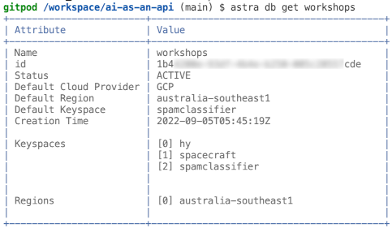

# Workshop: IRT AI / ML


### Learn to build your own NLP text classifier and expose it as an API using the following technologies:

- AI-based text analysis with Tensorflow/Keras;
- Astra DB, a Database-as-a-Service built on Apache Cassandra®;
- FastAPI, the high-performance Python framework for creating APIs;
- Many useful Python libraries and packages including `pandas`, `pydantic`, `dotenv`, `sklearn`, `uvicorn`, and more.

### During this hands-on workshop, you will:

- prepare the labeled dataset for model training;
- train the model to classify any input text;
- export the trained model and test it interactively;
- create your free NoSQL database for data storage;
- set up and start an API exposing the classifier as a reusable class;
- learn how to speed up the API with DB-based caching;
- inspect how a streaming response is handled in the API.

### Prerequisites:

- Familiarity with Python.
- A GitHub account.
    > If you do not have a GitHub account, create a free account at [GitHub](https://github.com/signup).

### Procedure:
To start with you will create an Astra database and initialise a GitPod environment. Those steps are documented below. 

The remainder of the workshop continues from within the GitPod environment deployed in Step 2, and the Jupyter notebook in Step 4.

---

## Step 1: Create a database in Astra DB

You will now create a database with a keyspace in it (a *keyspace* can contain tables). The API needs a couple of tables for persistent storage: they will be created programmatically on startup if they don't exist, so there's no need to worry too much about them.

Besides creating the database, you need to retrieve a *token*, that is, a set of credentials used later to connect to it in a secure and authenticated way.

1. Login to your Astra account.
    > If you do not have an Astra account, create a free trial account at [Astra Registration](https://astra.datastax.com/register).

2. Create a Database:
    1. Navigate to *Databases* in the Menu.
    2. Click the *Create Database* button.
    3. Create the database using the following:
        * Database Name: `workshops`
        * Keyspace Name: `spamclassifier`
        * Provider: `Google Cloudß`
        * Region: `us-east1`
        
        

3. Generate and retrieve a DB Token:
    1. Navigate to *Settings* in the Menu.
    2. Navigate to *Token Management* within the Settings sub-menu.
    3. Select the role `Database Administrator`.
    4. Click the *Generate Token* button.
    5. Click on *Download Token Details*.
    6. Open the downloaded file `GeneratedToken.csv` and verify that you can read the file.

        


## Step 2: Gitpod

Gitpod is an IDE in the cloud (modeled after VSCode). It comes with a full "virtual machine" (actually a Kubernetes-managed container), which you will use as if it were your own computer (e.g. downloading files, executing programs and scripts, training the model and eventually starting the API from it).

The button below will:

- spawn your own Gitpod container;
- clone this repository in it and open it in the IDE;
- preinstall the required dependencies.


**Click on the Gitpod button:**

<a href="https://gitpod.io/#https://github.com/HiltonRosenfeld/ai-as-an-api"></a>

> **Note**: you may have to authorise GitPod to sign in with your GitHub account.

> **Note**: For Choose an Editor, select VS Code • 1.x.x • Browser.

In a few minutes, a full IDE will be ready in the browser, with a file explorer on the left, a file editor on the top (with this very README open for convenience), and a console (`bash`) below it. Actually three consoles will be spawned for later convenience:

- `work-shell` (where the main work is done including running the API)
- `curl-shell` (to later issue `curl` commands to the API)
- `notebook-shell` (where Jupyter will keep running)

> **Note**: If you want to work on your laptop, make sure you install all Python dependencies listed in `requirements.txt` (doing so in a Python virtual environment is strongly suggested) and add the main repo root to the `PYTHONPATH`. (You might see "errors" related to mismatching versions between the `tensorflow` package and others, notably `numpy`: you should be able to ignore them and just go ahead.) If you are on Python 3.6, you will additionally need to install the `dataclasses` package (i.e. `pip install dataclasses`). Also, please note that the model training phase may take much longer than ten minutes, depending on your processing power.

<details>
<summary>
Show me a map of the Gitpod starting layout
</summary>


1. File explorer
2. Editor
3. Panel for console(s)
4. Console switcher
There are many more other features, probably familiar to those who have experience with VSCode. Feel free to play around a bit!
</details>

> **Note**: make sure you locate the "console switcher" on the bottom right; all commands, unless specified otherwise, are to be launched in the "work-shell" console.


## Step 3. Inspect the starting dataset
Open the file `training/dataset/spam-dataset.csv` and have a look at the lines there.
> Tip: you can open a file in Gitpod by locating it with the "File Explorer" on your left, but if you like using the keyboard you may simply issue the command `gp open training/dataset/spam-dataset.csv` from the `bash` Console at the bottom.

This is a CSV file with three columns (separated by commas):

- whether the line is spam or "ham" (i.e. the opposite of spam),
- a short piece of text (a "message"),
- the tag identifying the source of this datapoint (this will be ignored by the scripts).


The third column betrays the mixed origin of the data. To create our labeled dataset of 7,500 messages, two sets made available by the UCI Machine Learning Repository have been merged:
- [SMS Spam Collection Data Set](https://archive.ics.uci.edu/ml/datasets/SMS+Spam+Collection)
- [YouTube Spam Collection Data Set](https://archive.ics.uci.edu/ml/datasets/YouTube+Spam+Collection)

Luckily, the (not always fun) task of cleaning, validating and normalizing the heterogeneous (and usually imperfect) data has been already done for you -- something that is seldom the case, alas, in a real-world task.

Look at line 352 of this file for example. Is that message spam or ham?
> Tip: hit Ctrl-G in the Gitpod editor to jump to a specific line number.

<details>
<summary>Show me that line in Gitpod's editor</summary>


</details>


## Step 4. Train the Model in Jupyter

In the Gitpod environment, we started Jupyter for you (it is running in the notebook-shell console). To open it, run the following command, which will open a browser to the notebook server listening:

```
gp preview --external $(gp url 8888)/notebooks/notebook/machineLearning.ipynb
```

> *Note*: The password to unlock the notebook is `spamclassifier`.

### How to run the Jupyter Notebook
A notebook is made of "cells". Select a cell by clicking on it and execute it with Shift+Enter. Run all code cells in the notebook from the first to the last. 

**Note: there are cells with the sole purpose of inspecting the contents of some variables.**

Take your time, use them to better understand what's going on.


## Step 5. Expose the Model as an API

Now your model is trained and saved to disk, ready to be used, it is time to expose it with FastAPI in the form of easy-to-use HTTP requests.

You'll first look at a minimal version of the API, just to get a taste of how FastAPI works, and then turn to a full-fledged version, with more endpoints and a database-backed caching layer.


### Configure environment .env file
Now you need to prepare a configuration file to give the API all required parameters to connect to the database. Fortunately, the Astra CLI has you covered and will automate most of it for you: all you need is to run a couple of commands.

First, configure the Astra CLI so that it knows the "token" part of your DB Admin Token (i.e. the string starting with `AstraCS:...`):

```
astra setup
```

> **Note**: If you get a "command not found" error, please install Astra CLI manually with `curl -Ls "https://dtsx.io/get-astra-cli" | bash` and retry the above commands after running `source ~/.bashrc`.

<details>
<summary>Show me the setup step</summary>

</details>

You can test that everything works by inspecting your database:

```
astra db get workshops
```

<details>
<summary>Show me a typical output</summary>

</details>

At this point you can have the CLI prepare a `.env` file with all required connection information (keyspace name, access token, location of the [secure connect bundle](https://awesome-astra.github.io/docs/pages/astra/download-scb/) which it downloads automatically) available as environment variables:

```
astra db create-dotenv -k spamclassifier workshops
```

Let us add to this file a couple of settings specific to our API:

```
cat .app-env.sample >> .env
```

At this point, the `.env` file should be OK. If you are curious, have a look at what's in it: there will be keyspace name, connection secrets, API settings and so on.

<details>
<summary>Show me what the dot-env file might look like</summary>

</details>

> **Note**: If you don't have (or don't want to use) the actual trained model at hand, you can switch to a lightweight mock by setting `MOCK_MODEL_CLASS="1"` in this dot-env file. The API part of the practice would "not even notice the change".


### Minimal API
Now that the trained model is there, the `.env` file is ready and the secure bundle is in place, you can start a minimal form of the API with:

```
uvicorn api.minimain:miniapp --reload
```

> **Note**: In this command, you are telling `uvicorn` (an [ASGI server](https://www.uvicorn.org/) capable of running asynchronous Python APIs) to launch the miniapp API found in the minimain module; you also ask it to keep a watch on all involved files and auto-reload on any file change.

After some (rather verbose) output from Tensorflow, you should see the `INFO: Application startup complete`. The API has loaded the classifier and is ready to accept requests (on localhost and port 8000, as per defaults). You will first fire some requests and then have a quick look at how the code is structured.

> **Note**: This code is purposefully kept very simple: besides not implementing all the features, it also refrains from using some of the facilities provided by FastAPI to better focus on the basics. Look at the full API below for a more comprehensive usage of the framework.


