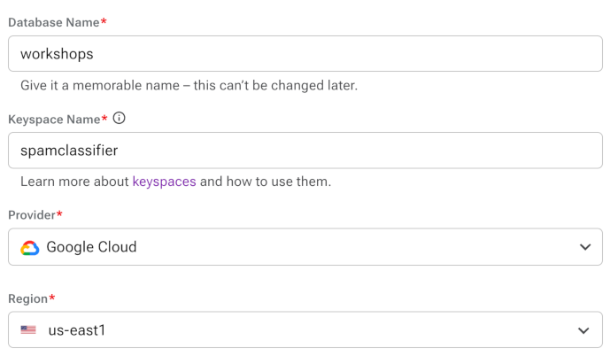

# Workshop: IRT AI / ML


### Learn to build your own NLP text classifier and expose it as an API using the following technologies:

- AI-based text analysis with Tensorflow/Keras;
- Astra DB, a Database-as-a-Service built on Apache Cassandra®;
- FastAPI, the high-performance Python framework for creating APIs;
- Many useful Python libraries and packages including `pandas`, `pydantic`, `dotenv`, `sklearn`, `uvicorn`, and more.

### During this hands-on workshop, you will:

- prepare the labeled dataset for model training;
- train the model to classify any input text;
- export the trained model and test it interactively;
- create your free NoSQL database for data storage;
- set up and start an API exposing the classifier as a reusable class;
- learn how to speed up the API with DB-based caching;
- inspect how a streaming response is handled in the API.

### Prerequisites:

- Familiarity with Python.
- A GitHub account.
    > If you do not have a GitHub account, create a free account at [GitHub](https://github.com/signup).

### Procedure:
To start with you will create an Astra database and initialise a GitPod environment. Those steps are documented below. 

The remainder of the workshop continues from within the GitPod environment deployed in Step 2.

---

## Step 1: Create a database in Astra DB

You will now create a database with a keyspace in it (a *keyspace* can contain tables). The API needs a couple of tables for persistent storage: they will be created programmatically on startup if they don't exist, so there's no need to worry too much about them.

Besides creating the database, you need to retrieve a *token*, that is, a set of credentials used later to connect to it in a secure and authenticated way.

1. Login to your Astra account.
    > If you do not have an Astra account, create a free trial account at [Astra Registration](https://astra.datastax.com/register).

2. Create a Database:
    1. Navigate to *Databases* in the Menu.
    2. Click the *Create Database* button.
    3. Create the database using the following:
        * Database Name: `workshops`
        * Keyspace Name: `spamclassifier`
        * Provider: `Google Cloudß`
        * Region: `us-east1`
        
        

3. Generate and retrieve a DB Token:
    1. Navigate to *Settings* in the Menu.
    2. Navigate to *Token Management* within the Settings sub-menu.
    3. Select the role `Database Administrator`.
    4. Click the *Generate Token* button.
    5. Click on *Download Token Details*.
    6. Open the downloaded file `GeneratedToken.csv` and verify that you can read the file.

        


## Step 2: Gitpod

Gitpod is an IDE in the cloud (modeled after VSCode). It comes with a full "virtual machine" (actually a Kubernetes-managed container), which you will use as if it were your own computer (e.g. downloading files, executing programs and scripts, training the model and eventually starting the API from it).

The button below will:

- spawn your own Gitpod container;
- clone this repository in it and open it in the IDE;
- preinstall the required dependencies.


**Click on the Gitpod button:**

<a href="https://gitpod.io/#https://github.com/HiltonRosenfeld/ai-as-an-api"></a>

> **Note**: you may have to authorise GitPod to sign in with your GitHub account.

> **Note**: For Choose an Editor, select VS Code • 1.x.x • Browser.

In a few minutes, a full IDE will be ready in the browser, with a file explorer on the left, a file editor on the top (with this very README open for convenience), and a console (`bash`) below it. Actually three consoles will be spawned for later convenience:

- `work-shell` (where the main work is done including running the API)
- `curl-shell` (to later issue `curl` commands to the API)
- `notebook-shell` (where Jupyter will keep running)

> **Note**: If you want to work on your laptop, make sure you install all Python dependencies listed in `requirements.txt` (doing so in a Python virtual environment is strongly suggested) and add the main repo root to the `PYTHONPATH`. (You might see "errors" related to mismatching versions between the `tensorflow` package and others, notably `numpy`: you should be able to ignore them and just go ahead.) If you are on Python 3.6, you will additionally need to install the `dataclasses` package (i.e. `pip install dataclasses`). Also, please note that the model training phase may take much longer than ten minutes, depending on your processing power.

<details>
<summary>
Show me a map of the Gitpod starting layout
</summary>


1. File explorer
2. Editor
3. Panel for console(s)
4. Console switcher
There are many more other features, probably familiar to those who have experience with VSCode. Feel free to play around a bit!
</details>

> **Note**: make sure you locate the "console switcher" on the bottom right; all commands, unless specified otherwise, are to be launched in the "work-shell" console.


## Step 3. Open Jupyter

In the Gitpod environment, we started Jupyter for you (it is running in the notebook-shell console). To open it, run the following command, which will open a browser to the notebook server listening:

```
gp preview --external $(gp url 8888)/notebooks/notebook/machineLearning.ipynb
```

> *Note*: The password to unlock the notebooks is `spamclassifier`.

Once the notebook is available, navigate to the notebook directory and click on prepareDataset.ipynb to open it (in yet another tab).

### How to run the Jupyter Notebook
A notebook is made of "cells". Select a cell by clicking on it and execute it with Shift+Enter. Run all code cells in the notebook from the first to the last. 

**Note: there are cells with the sole purpose of inspecting the contents of some variables.**

Take your time, use them to better understand what's going on.

